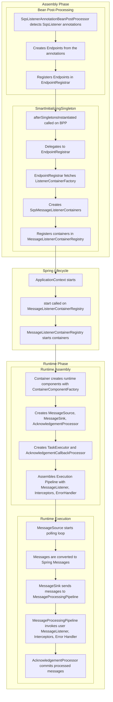

# Spring Cloud AWS - SQS Module

This module provides support for working with Amazon SQS in Spring Boot applications using non-blocking I/O and modular, composable runtime infrastructure.

This README provides a **high-level architectural overview** for developers working on the SQS module.

---

## Design Principles

### Composable Runtime
- The system is built from independent, pluggable components, each with a well-defined responsibility, such as polling, message conversion, execution, and acknowledgment.
- These components are wired together at container startup, making it easy to swap or extend behavior without modifying the container itself.

### Async by Default
- All runtime processing is non-blocking, using `CompletableFuture` and the AWS SDK v2 async client (`SqsAsyncClient`) under the hood.
- This allows the container to efficiently scale with a small number of threads, improves latency under load, and integrates well with reactive or concurrent applications.

### Extensible
- Core behaviors, such as message grouping, message polling, backpressure handling and acknowledgment can be customized via pluggable interfaces and factory components, without modifying the base classes.
- This promotes stability and makes the module easier to evolve without breaking downstream usage.

### SQS-Agnostic Messaging Core
- Abstract messaging components are designed to be protocol-agnostic.
- The runtime pipeline, container lifecycle, acknowledgment logic, and interception model are not tied to SQS.
- This allows for potential reuse across other transports and keeps SQS-specific behavior isolated to its own layer, as well as provide proper separation of concerns.

---

## Architecture Overview

The architecture of the SQS module is divided into two main parts:

- The **Assembly Phase**, where listener containers and supporting infrastructure are configured using Spring abstractions.
- The **Runtime Phase**, where runtime components are assembled, messages are polled, converted, processed, and acknowledged using an asynchronous pipeline.

---

---

### Assembly Phase

- Built on standard Spring Messaging abstractions
- Inspired by Spring for Apache Kafka
- Processes `@SqsListener` annotations to register listener containers
- Separates generic messaging logic (in abstract classes) from SQS-specific configuration

---

### Runtime Phase

- Fully **asynchronous** and **non-blocking**, built on `CompletableFuture`
- Leverages AWS SDK v2’s async client (`SqsAsyncClient`) for efficient I/O
- Runtime behavior is split into **modular components**, each with a clear responsibility (e.g. polling, conversion, processing, acknowledgement)
- Components are assembled during container startup by the `ContainerComponentFactory`
- Designed for **extensibility**: custom behavior can be added or replaced without modifying the core runtime logic
- Promotes **composition over inheritance**
- See [`docs/runtime-architecture.md`](arch-docs/runtime-architecture.md) for a breakdown of internal layers and components
