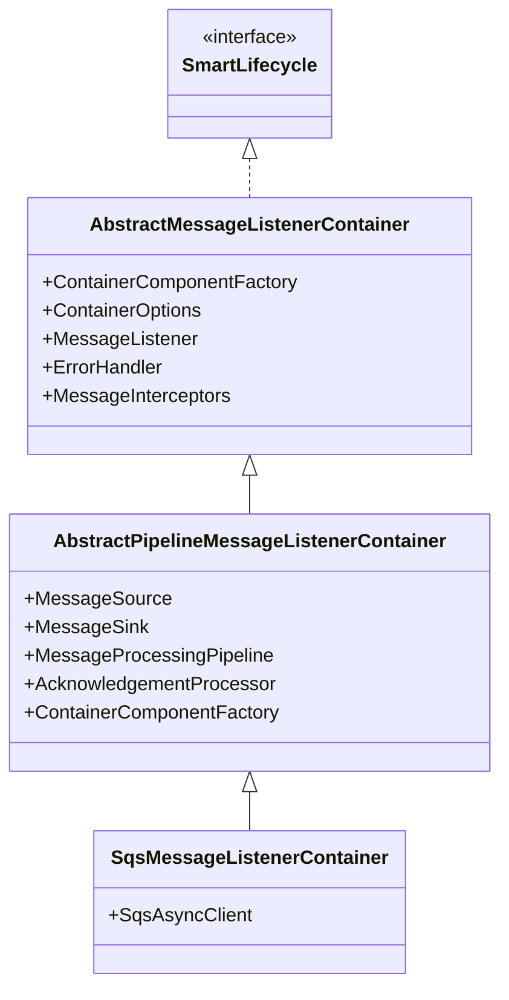
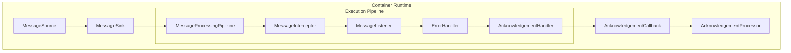

# Runtime Architecture

This document describes the internal architecture of the SQS listener container at runtime.  
It covers the container layers, the core processing components, and how they are assembled and executed.

---

## Container Layers

The runtime container is composed of three layered classes. Each layer builds on the previous one to create a fully configured, executable message pipeline.

### 1. [`AbstractMessageListenerContainer`](https://github.com/awspring/spring-cloud-aws/blob/main/spring-cloud-aws-sqs/src/main/java/io/awspring/cloud/sqs/listener/AbstractMessageListenerContainer.java)
- Implements [`SmartLifecycle`](https://docs.spring.io/spring-framework/docs/current/javadoc-api/org/springframework/context/SmartLifecycle.html), participating in Spring’s lifecycle and phase-based startup/shutdown
- Holds container configuration, including the message listener, error handler, interceptors, and queue names
- Base class for lifecycle-managed listener containers with configurable components

### 2. [`AbstractPipelineMessageListenerContainer`](https://github.com/awspring/spring-cloud-aws/blob/main/spring-cloud-aws-sqs/src/main/java/io/awspring/cloud/sqs/listener/AbstractPipelineMessageListenerContainer.java)
- Builds the runtime message pipeline by wiring together components such as [`MessageSource`](https://github.com/awspring/spring-cloud-aws/blob/main/spring-cloud-aws-sqs/src/main/java/io/awspring/cloud/sqs/listener/source/MessageSource.java), [`MessageSink`](https://github.com/awspring/spring-cloud-aws/blob/main/spring-cloud-aws-sqs/src/main/java/io/awspring/cloud/sqs/listener/sink/MessageSink.java), and [`AcknowledgementProcessor`](https://github.com/awspring/spring-cloud-aws/blob/main/spring-cloud-aws-sqs/src/main/java/io/awspring/cloud/sqs/listener/acknowledgement/AcknowledgementProcessor.java)
- Orchestrates message flow, error handling, and coordination between runtime components

### 3. [`SqsMessageListenerContainer`](https://github.com/awspring/spring-cloud-aws/blob/main/spring-cloud-aws-sqs/src/main/java/io/awspring/cloud/sqs/listener/SqsMessageListenerContainer.java)
- Applies SQS-specific configuration (e.g. queue type, client setup)
- Serves as the default listener container for both [`@SqsListener`](https://github.com/awspring/spring-cloud-aws/blob/main/spring-cloud-aws-sqs/src/main/java/io/awspring/cloud/sqs/annotation/SqsListener.java) and manual usage
- Registered with [`MessageListenerContainerRegistry`](https://github.com/awspring/spring-cloud-aws/blob/main/spring-cloud-aws-sqs/src/main/java/io/awspring/cloud/sqs/listener/MessageListenerContainerRegistry.java) for coordinated lifecycle management

---

## Runtime Components

At runtime, the container delegates message handling to a pipeline composed of three main component types:

- [`MessageSource`](https://github.com/awspring/spring-cloud-aws/blob/main/spring-cloud-aws-sqs/src/main/java/io/awspring/cloud/sqs/listener/source/MessageSource.java): Responsible for polling messages and preparing them for processing. It emits a [`MessageProcessingContext`](https://github.com/awspring/spring-cloud-aws/blob/main/spring-cloud-aws-sqs/src/main/java/io/awspring/cloud/sqs/listener/MessageProcessingContext.java), which carries processing metadata such as acknowledgement callbacks, backpressure hooks, and dynamically-added interceptors.

- [`MessageSink`](https://github.com/awspring/spring-cloud-aws/blob/main/spring-cloud-aws-sqs/src/main/java/io/awspring/cloud/sqs/listener/sink/MessageSink.java): Consumes the message and its associated context, invoking the user-defined listener. Different implementations control parallelism, ordering, batching, and visibility extension.

- [`AcknowledgementProcessor`](https://github.com/awspring/spring-cloud-aws/blob/main/spring-cloud-aws-sqs/src/main/java/io/awspring/cloud/sqs/listener/acknowledgement/AcknowledgementProcessor.java): Responsible for final message acknowledgment. It determines when and how to acknowledge messages—immediately, in batch, or in a coordinated/ordered fashion.

These components are assembled at runtime by the [`ContainerComponentFactory`](https://github.com/awspring/spring-cloud-aws/blob/main/spring-cloud-aws-sqs/src/main/java/io/awspring/cloud/sqs/listener/factory/ContainerComponentFactory.java), which wires together the processing pipeline used by the container.

---

### MessageSource

Responsible for polling and converting messages from SQS into the processing pipeline.

- [`AbstractMessageConvertingMessageSource`](https://github.com/awspring/spring-cloud-aws/blob/main/spring-cloud-aws-sqs/src/main/java/io/awspring/cloud/sqs/listener/source/AbstractMessageConvertingMessageSource.java): Adds support for converting payloads into Spring [`Message`](https://github.com/spring-projects/spring-framework/blob/main/spring-messaging/src/main/java/org/springframework/messaging/Message.java) objects.

- [`AbstractPollingMessageSource`](https://github.com/awspring/spring-cloud-aws/blob/main/spring-cloud-aws-sqs/src/main/java/io/awspring/cloud/sqs/listener/source/AbstractPollingMessageSource.java): Manages the polling loop, conversion, backpressure handling, and emits a [`MessageProcessingContext`](https://github.com/awspring/spring-cloud-aws/blob/main/spring-cloud-aws-sqs/src/main/java/io/awspring/cloud/sqs/listener/MessageProcessingContext.java) with the message.

- [`AbstractSqsMessageSource`](https://github.com/awspring/spring-cloud-aws/blob/main/spring-cloud-aws-sqs/src/main/java/io/awspring/cloud/sqs/listener/source/AbstractSqsMessageSource.java): Adds SQS-specific logic, such as batch polling and [`SqsAsyncClient`](https://github.com/aws/aws-sdk-java-v2/blob/main/services/sqs/src/main/java/software/amazon/awssdk/services/sqs/SqsAsyncClient.java) integration from the AWS SDK v2.

- [`StandardSqsMessageSource`](https://github.com/awspring/spring-cloud-aws/blob/main/spring-cloud-aws-sqs/src/main/java/io/awspring/cloud/sqs/listener/source/StandardSqsMessageSource.java) & [`FifoSqsMessageSource`](https://github.com/awspring/spring-cloud-aws/blob/main/spring-cloud-aws-sqs/src/main/java/io/awspring/cloud/sqs/listener/source/FifoSqsMessageSource.java): Handle queue-type-specific behaviors, such as setting `receiveRequestAttemptId` for FIFO queues.

---

### MessageSink

Consumes the `MessageProcessingContext` and invokes the application’s listener logic. Different implementations control **parallelism, ordering, batching, and visibility extension**.

- [`AbstractMessageProcessingPipelineSink`](https://github.com/awspring/spring-cloud-aws/blob/main/spring-cloud-aws-sqs/src/main/java/io/awspring/cloud/sqs/listener/sink/AbstractMessageProcessingPipelineSink.java): Base implementation, handles listener invocation, observability, and forwarding to acknowledgment handling.

- [`BatchMessageSink`](https://github.com/awspring/spring-cloud-aws/blob/main/spring-cloud-aws-sqs/src/main/java/io/awspring/cloud/sqs/listener/sink/BatchMessageSink.java): Sends an entire batch of messages as a single unit to the listener.

- [`FanOutMessageSink`](https://github.com/awspring/spring-cloud-aws/blob/main/spring-cloud-aws-sqs/src/main/java/io/awspring/cloud/sqs/listener/sink/FanOutMessageSink.java): Processes each message in parallel for throughput.

- [`OrderedMessageSink`](https://github.com/awspring/spring-cloud-aws/blob/main/spring-cloud-aws-sqs/src/main/java/io/awspring/cloud/sqs/listener/sink/OrderedMessageSink.java): Ensures messages are processed serially to preserve order.

- [`MessageGroupingSinkAdapter`](https://github.com/awspring/spring-cloud-aws/blob/main/spring-cloud-aws-sqs/src/main/java/io/awspring/cloud/sqs/listener/sink/MessageGroupingSinkAdapter.java): Groups messages based on a configurable key function (e.g., grouping by MessageGroupId) before processing.

- [`MessageVisibilityExtendingSinkAdapter`](https://github.com/awspring/spring-cloud-aws/blob/main/spring-cloud-aws-sqs/src/main/java/io/awspring/cloud/sqs/listener/sink/MessageVisibilityExtendingSinkAdapter.java): Extends message visibility timeout just before processing to prevent early re-delivery.

- [`AbstractDelegatingMessageListeningSinkAdapter`](https://github.com/awspring/spring-cloud-aws/blob/main/spring-cloud-aws-sqs/src/main/java/io/awspring/cloud/sqs/listener/sink/AbstractDelegatingMessageListeningSinkAdapter.java): Facilitates composition or decoration of sinks for dynamic behavior injection.

---

### AcknowledgementProcessor

Responsible for acknowledging messages once processing completes.

- [`AbstractOrderingAcknowledgementProcessor`](https://github.com/awspring/spring-cloud-aws/blob/main/spring-cloud-aws-sqs/src/main/java/io/awspring/cloud/sqs/listener/acknowledgement/AbstractOrderingAcknowledgementProcessor.java): Base class for acknowledgement processors that require ordered tracking and coordination across messages.

- [`ImmediateAcknowledgementProcessor`](https://github.com/awspring/spring-cloud-aws/blob/main/spring-cloud-aws-sqs/src/main/java/io/awspring/cloud/sqs/listener/acknowledgement/ImmediateAcknowledgementProcessor.java): Sends acknowledgements synchronously as soon as each message or batch of messages is successfully processed.

- [`BatchingAcknowledgementProcessor`](https://github.com/awspring/spring-cloud-aws/blob/main/spring-cloud-aws-sqs/src/main/java/io/awspring/cloud/sqs/listener/acknowledgement/BatchingAcknowledgementProcessor.java): Buffers acknowledgements and sends them in asynchronous batches to reduce network calls and increase efficiency.

---
### Execution Pipeline

Once a message is passed to the [`AbstractMessageProcessingPipelineSink`](https://github.com/awspring/spring-cloud-aws/blob/main/spring-cloud-aws-sqs/src/main/java/io/awspring/cloud/sqs/listener/sink/AbstractMessageProcessingPipelineSink.java), it flows through an **execution pipeline** that applies cross-cutting concerns and invokes the message listener.

This pipeline is orchestrated by the [`MessageProcessingPipeline`](https://github.com/awspring/spring-cloud-aws/blob/main/spring-cloud-aws-sqs/src/main/java/io/awspring/cloud/sqs/listener/pipeline/MessageProcessingPipeline.java) and includes the following core stages:

- [`MessageInterceptor`](https://github.com/awspring/spring-cloud-aws/blob/main/spring-cloud-aws-sqs/src/main/java/io/awspring/cloud/sqs/listener/interceptor/MessageInterceptor.java): Pre- and post-processing hooks

- [`MessageListener`](https://github.com/awspring/spring-cloud-aws/blob/main/spring-cloud-aws-sqs/src/main/java/io/awspring/cloud/sqs/listener/acknowledgement/handler/MessageListener.java): Invokes the user-defined method (batch or single-message)

- [`ErrorHandler`](https://github.com/awspring/spring-cloud-aws/blob/main/spring-cloud-aws-sqs/src/main/java/io/awspring/cloud/sqs/listener/error/ErrorHandler.java): Handles exceptions during processing

- [`AcknowledgementHandler`](https://github.com/awspring/spring-cloud-aws/blob/main/spring-cloud-aws-sqs/src/main/java/io/awspring/cloud/sqs/listener/acknowledgement/handler/AcknowledgementHandler.java): Commits messages according to the configured strategy

## Summary

The SQS container architecture is built on a **layered class hierarchy** that progressively assembles a runtime message pipeline:

- `AbstractMessageListenerContainer` provides configuration and lifecycle integration
- `AbstractPipelineMessageListenerContainer` wires together the runtime components
- `SqsMessageListenerContainer` applies SQS-specific settings and registers the container

At runtime, messages are produced by a `MessageSource`, passed through a `MessageSink` that runs the **execution pipeline**, and finally acknowledged by an `AcknowledgementProcessor`. These components are assembled by the `ContainerComponentFactory`, which serves as the central customization and extension point.

The **execution pipeline** includes pluggable stages like interceptors, listeners, error handlers, and acknowledgement handlers, enabling cross-cutting behavior to be added by the user.

---
